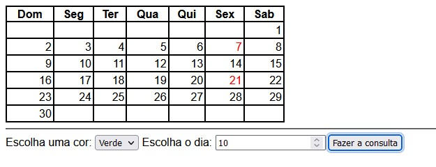

# Calendário Interativo

## Descrição
Calendário Interativo para o estudo de funções em JS e fixação dos conteúdos aprendidos sobre as tag de criação de tabelas.

## Funcioanlidades
Seleciona a cor desejada e o dia que será marcado.

Após click em "Fazer a consulta" para que seja marcado o dia com a cor desejada.

Em seguida, você verá o dia sendo marcado.

## Tecnologia Utilizadas
- :heavy_check_mark: [HTML]
- :heavy_check_mark: [CSS]
- :heavy_check_mark: [GIT]
- :heavy_check_mark: [JS]

## Autor
Aluno: Caio Estevão
- Github: [github.com](https://github.com/Caioestevao1000)

### Auxílio
Professor: Leonardo Rocha
- Github: [github.com](https://github.com/LeonardoRochaMarista)

